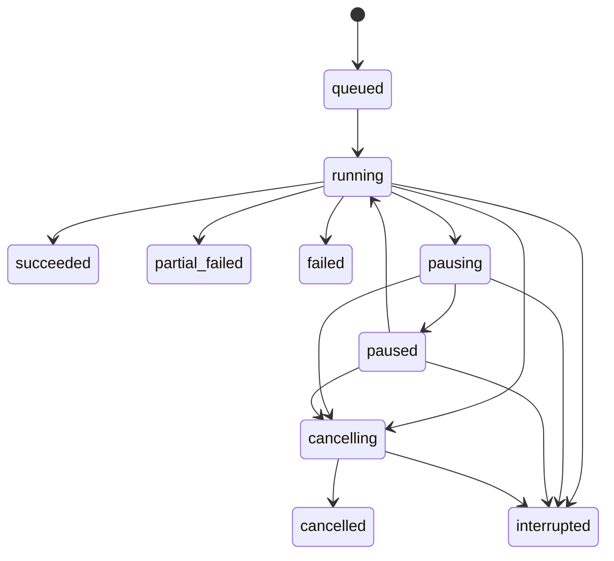

# Upload Job / Retry / Progress / SSE Engineering Plan

Status: decision-complete plan for branch `codex/upload-job-sse`

Scope: v1 Core Ops real upload job execution, retry failed, progress, and job log streaming

This plan follows `AGENTS.md`, `docs/00_product_scope.md`, `docs/02_engineering_plan.md`, `docs/03_ui_ux_plan.md`, `docs/04_design_system.md`, and `docs/07_upload_preview_plan.md`.

## Decisions

1. Upload jobs start only from a completed Upload Preview run.
   `POST /api/upload/jobs` requires `previewRunId`. The backend snapshots eligible `preview_items.status = 'target'` rows into `upload_job_files`. `partial_overlap`, `risky`, `excluded`, and `already_in_db` are never uploaded by default in v1.

2. Preview-origin upload disables legacy latest-timestamp Smart Sync filtering.
   The legacy uploader's latest timestamp optimization can skip missing older rows when the database has newer rows for the same device. Preview already performs exact `(timestamp, device_id)` reconciliation, so the upload job sends target file rows and relies on `all_metrics(timestamp, device_id)` upsert safety for final duplicate protection.

3. Smart Sync is preserved as tested legacy behavior, but not as the default preview-to-upload filter.
   Keep the extracted latest-timestamp code and regression tests. In the web path, `enable_smart_sync = false` for `mode = preview_targets`. A future explicit operator setting can re-enable it only after the UI explains the tradeoff and audit logs the choice.

4. Job progress/log streaming uses SSE backed by persisted `job_events`.
   Every event is written to SQLite first, then streamed. UI reconnects with `Last-Event-ID` or `afterSeq`, so browser refreshes do not lose logs.

5. Upload worker is backend in-process `ThreadPoolExecutor`.
   v1 is a localhost operator-PC app. No Celery/RQ. The durability boundary is SQLite WAL plus startup interruption handling.

6. Pause/resume/cancel are cooperative.
   Pause and cancel are checked before files, between chunks, between batches, and between retry sleeps. An in-flight HTTP call to the Edge Function is bounded by timeout, not forcibly killed.

7. Background failures must hit three surfaces.
   Every failure writes `upload_jobs` / `upload_job_files`, a `job_events` error row, and an audit row. UI surfaces the same job id in Upload Job, Logs, and Dashboard.

8. Upload execution introduces a web app state store, not a legacy state import.
   Do not import `uploader_state.db`. New resume/retry state lives in the web SQLite DB.

## Architecture

```text
+---------------------+       +--------------------------+
| Upload Preview UI   |       | Upload Job UI            |
| Preview tab         |       | Job tab + EventSource    |
+----------+----------+       +------------+-------------+
           |                               |
           | POST /api/upload/jobs         | GET /events SSE
           v                               v
+---------------------------------------------------------+
| FastAPI upload job API                                  |
| - validates preview/job state                           |
| - creates upload_jobs + upload_job_files                 |
| - submits UploadJobService to ThreadPoolExecutor         |
+--------------------------+------------------------------+
                           |
                           v
+---------------------------------------------------------+
| UploadJobService                                        |
| - snapshots target files from preview                    |
| - revalidates file signatures before upload              |
| - calls extracted upload core with repository callbacks  |
| - writes file state, job summaries, job_events, audit    |
+--------------------------+------------------------------+
                           |
                           v
+---------------------+       +---------------------------+
| Local CSV files      |       | local Supabase Edge Fn    |
| transformed in chunks| ----> | /functions/v1/upload-metrics |
+---------------------+       | upsert on timestamp,device_id |
                              +---------------------------+
```

## Backend Modules

```text
backend/app/api/upload_jobs.py
backend/app/schemas/upload_jobs.py
backend/app/db/upload_job_repository.py
backend/app/services/upload_jobs.py
backend/app/services/job_event_stream.py
backend/app/core/upload_core.py
backend/app/core/transform_core.py
backend/app/core/file_state_keys.py
backend/app/db/audit_repository.py
```

Extraction rules:

- Copy/extract legacy upload and transform logic into this repo. Do not import from `C:\Users\user\Documents\GitHub\Extrusion_data` at runtime.
- Keep the callback-oriented shape of `run_upload_session`, but adapt types to web ids (`str | None`) and web repositories.
- Remove direct dependency on legacy `core.state` functions. The web wrapper injects `get_resume_offset`, `set_resume_offset`, `mark_file_completed`, and `record_file_failure`.
- Preserve Edge Function payload shape and `onConflict: "timestamp,device_id"` safety.

## API

### `POST /api/upload/jobs`

Start a real upload job from a preview run.

Request:

```json
{
  "previewRunId": "prv_abc123",
  "mode": "preview_targets",
  "options": {
    "batchRows": 2000,
    "chunkRows": 10000,
    "maxWorkers": 1,
    "httpTimeoutSeconds": 30,
    "retryAttempts": 3
  }
}
```

Rules:

- Preview run must exist and be terminal.
- Preview run status must be `succeeded`.
- Preview DB status must be `reachable`.
- At least one `target` item must exist.
- No active preview or upload job may be running.
- Files are revalidated against stored `file_signature` before upload.
- If a target file changed since preview, that file becomes `failed/file_changed_since_preview` and the job can become `partial_failed`.

Response `202`:

```json
{
  "jobId": "upl_abc123",
  "status": "queued",
  "detailUrl": "/api/upload/jobs/upl_abc123",
  "eventsUrl": "/api/upload/jobs/upl_abc123/events"
}
```

Conflict `409`:

```json
{
  "detail": {
    "activeJobId": "upl_active",
    "reason": "active_upload_job"
  }
}
```

### `GET /api/upload/jobs`

List upload jobs.

Query:

```text
status=running|failed|partial_failed|succeeded
limit=50
offset=0
```

### `GET /api/upload/jobs/latest`

Return the latest upload job with files and summary. `404` if none exists.

### `GET /api/upload/jobs/{jobId}`

Return one job, its file rows, and recent event tail.

Response shape:

```json
{
  "job": {
    "jobId": "upl_abc123",
    "previewRunId": "prv_abc123",
    "retryOfJobId": null,
    "mode": "preview_targets",
    "status": "running",
    "requestedAt": "2026-06-02T00:00:00+00:00",
    "startedAt": "2026-06-02T00:00:01+00:00",
    "finishedAt": null,
    "summary": {
      "totalFiles": 12,
      "succeededFiles": 4,
      "failedFiles": 0,
      "cancelledFiles": 0,
      "totalRows": 120000,
      "processedRows": 42000,
      "uploadedRows": 42000,
      "insertedRows": 41880,
      "warningCount": 0
    },
    "errorCode": null,
    "errorMessage": null
  },
  "files": [],
  "events": [],
  "eventCursor": {
    "latestSeq": 84
  }
}
```

### `POST /api/upload/jobs/{jobId}/retry`

Create a new retry job from failed or interrupted files in a previous job.

Request:

```json
{
  "includeInterrupted": true,
  "includeCancelled": false,
  "options": {
    "batchRows": 2000,
    "chunkRows": 10000,
    "maxWorkers": 1
  }
}
```

Rules:

- Original job must be terminal.
- Retry includes files with status `failed` and optionally `interrupted`.
- Retry does not mutate the original job.
- Retry snapshots the failed file rows into a new job with `retryOfJobId`.
- Retry uses stored `resumeOffset` where safe.

### `POST /api/upload/jobs/{jobId}/pause`

Allowed from `queued` or `running`.

Effect:

- Set `upload_jobs.status = 'pausing'`.
- Set control flag `pause_requested = 1`.
- Worker reaches a control checkpoint, emits `job.paused`, and sets `paused`.

### `POST /api/upload/jobs/{jobId}/resume`

Allowed from `paused`.

Effect:

- Clear `pause_requested`.
- Set status `running`.
- Worker continues from current file and resume offsets.

### `POST /api/upload/jobs/{jobId}/cancel`

Allowed from `queued`, `running`, `pausing`, or `paused`.

Effect:

- Set `cancel_requested = 1`.
- Set status `cancelling`.
- Worker marks not-yet-started files `cancelled`.
- Worker exits at the next control checkpoint.
- Final job status is `cancelled` if cancellation is the only terminal condition, otherwise `partial_failed`.

### `GET /api/upload/jobs/{jobId}/events`

SSE stream for progress and logs.

Query:

```text
afterSeq=84
tail=100
```

Headers:

- Accepts `Last-Event-ID`.
- Returns `Content-Type: text/event-stream`.
- Sends heartbeat comments every 15 seconds.

SSE event format:

```text
id: 85
event: file.progress
data: {"jobId":"upl_abc123","fileId":12,"processedRows":42000,"totalRows":120000}
```

Event types:

```text
job.created
job.started
job.progress
job.pausing
job.paused
job.resumed
job.cancelling
job.cancelled
job.succeeded
job.partial_failed
job.failed
job.interrupted
file.queued
file.started
file.progress
file.succeeded
file.failed
file.cancelled
log.info
log.warning
log.error
audit.recorded
heartbeat
```

## DTOs

```python
class UploadJobMode(str, Enum):
    preview_targets = "preview_targets"
    retry_failed = "retry_failed"

class UploadJobStatus(str, Enum):
    queued = "queued"
    running = "running"
    succeeded = "succeeded"
    partial_failed = "partial_failed"
    failed = "failed"
    pausing = "pausing"
    paused = "paused"
    cancelling = "cancelling"
    cancelled = "cancelled"
    interrupted = "interrupted"

class UploadJobFileStatus(str, Enum):
    queued = "queued"
    running = "running"
    succeeded = "succeeded"
    failed = "failed"
    skipped = "skipped"
    cancelled = "cancelled"
    interrupted = "interrupted"

class JobEventLevel(str, Enum):
    debug = "debug"
    info = "info"
    warning = "warning"
    error = "error"

class UploadJobOptions(ApiModel):
    batch_rows: int = Field(default=2000, ge=100, le=10000)
    chunk_rows: int = Field(default=10000, ge=1000, le=100000)
    max_workers: int = Field(default=1, ge=1, le=4)
    http_timeout_seconds: int = Field(default=30, ge=5, le=120)
    retry_attempts: int = Field(default=3, ge=0, le=5)

class UploadJobCreateRequest(ApiModel):
    preview_run_id: str
    mode: UploadJobMode = UploadJobMode.preview_targets
    options: UploadJobOptions = Field(default_factory=UploadJobOptions)

class RetryFailedRequest(ApiModel):
    include_interrupted: bool = True
    include_cancelled: bool = False
    options: UploadJobOptions = Field(default_factory=UploadJobOptions)
```

## SQLite Schema

These tables are added to the existing web state DB at `EWC_STATE_DB_PATH`.

```sql
CREATE TABLE IF NOT EXISTS upload_jobs (
  job_id TEXT PRIMARY KEY,
  preview_run_id TEXT REFERENCES preview_runs(preview_run_id),
  retry_of_job_id TEXT REFERENCES upload_jobs(job_id),
  mode TEXT NOT NULL CHECK(mode IN ('preview_targets','retry_failed')),
  status TEXT NOT NULL CHECK(status IN (
    'queued','running','succeeded','partial_failed','failed',
    'pausing','paused','cancelling','cancelled','interrupted'
  )),
  requested_at TEXT NOT NULL,
  started_at TEXT,
  finished_at TEXT,
  actor TEXT NOT NULL DEFAULT 'local_operator',
  options_json TEXT NOT NULL,
  config_snapshot_json TEXT NOT NULL,
  pause_requested INTEGER NOT NULL DEFAULT 0,
  cancel_requested INTEGER NOT NULL DEFAULT 0,
  total_files INTEGER NOT NULL DEFAULT 0,
  succeeded_files INTEGER NOT NULL DEFAULT 0,
  failed_files INTEGER NOT NULL DEFAULT 0,
  cancelled_files INTEGER NOT NULL DEFAULT 0,
  total_rows INTEGER NOT NULL DEFAULT 0,
  processed_rows INTEGER NOT NULL DEFAULT 0,
  uploaded_rows INTEGER NOT NULL DEFAULT 0,
  inserted_rows INTEGER NOT NULL DEFAULT 0,
  warning_count INTEGER NOT NULL DEFAULT 0,
  error_code TEXT,
  error_message TEXT,
  created_at TEXT NOT NULL,
  updated_at TEXT NOT NULL
);

CREATE TABLE IF NOT EXISTS upload_job_files (
  job_file_id INTEGER PRIMARY KEY AUTOINCREMENT,
  job_id TEXT NOT NULL REFERENCES upload_jobs(job_id) ON DELETE CASCADE,
  preview_item_id INTEGER REFERENCES preview_items(preview_item_id),
  file_key TEXT NOT NULL,
  folder_label TEXT NOT NULL,
  folder_path TEXT NOT NULL,
  filename TEXT NOT NULL,
  path TEXT NOT NULL,
  kind TEXT NOT NULL,
  file_date TEXT,
  file_signature TEXT NOT NULL,
  source_preview_status TEXT,
  source_reason_code TEXT,
  status TEXT NOT NULL CHECK(status IN (
    'queued','running','succeeded','failed','skipped','cancelled','interrupted'
  )),
  row_count INTEGER,
  processed_rows INTEGER NOT NULL DEFAULT 0,
  uploaded_rows INTEGER NOT NULL DEFAULT 0,
  inserted_rows INTEGER NOT NULL DEFAULT 0,
  resume_offset INTEGER NOT NULL DEFAULT 0,
  retry_count INTEGER NOT NULL DEFAULT 0,
  started_at TEXT,
  finished_at TEXT,
  last_error_code TEXT,
  last_error_message TEXT,
  created_at TEXT NOT NULL,
  updated_at TEXT NOT NULL,
  UNIQUE(job_id, file_key)
);

CREATE TABLE IF NOT EXISTS upload_file_state (
  file_key TEXT PRIMARY KEY,
  legacy_key TEXT NOT NULL,
  folder_label TEXT NOT NULL,
  folder_path TEXT NOT NULL,
  filename TEXT NOT NULL,
  path TEXT NOT NULL,
  kind TEXT NOT NULL,
  file_signature TEXT NOT NULL,
  state TEXT NOT NULL CHECK(state IN (
    'new','in_progress','completed','failed','cancelled','interrupted'
  )),
  resume_offset INTEGER NOT NULL DEFAULT 0,
  last_error_code TEXT,
  last_error_message TEXT,
  retry_count INTEGER NOT NULL DEFAULT 0,
  completed_at TEXT,
  failed_at TEXT,
  last_job_id TEXT REFERENCES upload_jobs(job_id),
  created_at TEXT NOT NULL,
  updated_at TEXT NOT NULL
);

CREATE TABLE IF NOT EXISTS job_events (
  event_id INTEGER PRIMARY KEY AUTOINCREMENT,
  job_id TEXT NOT NULL REFERENCES upload_jobs(job_id) ON DELETE CASCADE,
  seq INTEGER NOT NULL,
  ts TEXT NOT NULL,
  level TEXT NOT NULL CHECK(level IN ('debug','info','warning','error')),
  event_type TEXT NOT NULL,
  message TEXT NOT NULL,
  job_file_id INTEGER REFERENCES upload_job_files(job_file_id),
  data_json TEXT NOT NULL DEFAULT '{}',
  created_at TEXT NOT NULL,
  UNIQUE(job_id, seq)
);

CREATE INDEX IF NOT EXISTS idx_upload_jobs_status_created
  ON upload_jobs(status, created_at DESC);

CREATE INDEX IF NOT EXISTS idx_upload_job_files_job_status
  ON upload_job_files(job_id, status);

CREATE INDEX IF NOT EXISTS idx_upload_file_state_state
  ON upload_file_state(state, updated_at DESC);

CREATE INDEX IF NOT EXISTS idx_job_events_job_seq
  ON job_events(job_id, seq);
```

Audit table, if not already present when this work starts:

```sql
CREATE TABLE IF NOT EXISTS audit_log (
  audit_id INTEGER PRIMARY KEY AUTOINCREMENT,
  ts TEXT NOT NULL,
  actor TEXT NOT NULL DEFAULT 'local_operator',
  action TEXT NOT NULL,
  target_type TEXT NOT NULL,
  target_id TEXT,
  params_json_redacted TEXT NOT NULL DEFAULT '{}',
  result TEXT NOT NULL CHECK(result IN ('success','failure','cancelled','blocked')),
  error_code TEXT,
  error_message TEXT,
  job_id TEXT,
  request_id TEXT,
  created_at TEXT NOT NULL
);
```

## State Transitions



Terminal states:

```text
succeeded
partial_failed
failed
cancelled
interrupted
```

Active states:

```text
queued
running
pausing
paused
cancelling
```

Startup recovery:

- `queued`, `running`, `pausing`, `paused`, and `cancelling` upload jobs become `interrupted`.
- `running` / `queued` / `cancelled`-pending file rows become `interrupted` or `cancelled` based on job control state.
- A `job.interrupted` event is inserted for every interrupted job.
- An audit row records `upload.interrupted` with result `failure`.
- No automatic resume on startup. Operator must click Retry Failed.

## Preview To Upload Data Flow

```text
Operator clicks Start Upload
  -> POST /api/upload/jobs { previewRunId }
  -> validate preview terminal and DB reachable
  -> reject if preview has no targets
  -> reject if active upload job exists
  -> snapshot preview_items.status='target' into upload_job_files
  -> create upload_jobs row queued
  -> audit upload.start success/blocked
  -> worker marks job running
  -> re-stat each file, compare file_signature
  -> transform CSV chunks
  -> upload batches to Edge Function
  -> Edge Function upserts all_metrics on (timestamp, device_id)
  -> repository callbacks update upload_job_files + upload_file_state
  -> append job_events
  -> SSE streams persisted events
  -> final upload_jobs status + audit row
```

Start Upload is blocked when:

- Preview is missing.
- Preview is `running`, `queued`, `cancelling`, `cancelled`, `failed`, `partial_failed`, or `timed_out`.
- Preview DB status is `unreachable` or `query_failed`.
- Any upload job is active.
- Required upload config is missing: Supabase URL, anon key, Edge URL.
- Localhost-only middleware rejects the client.

## Smart Sync Policy

Legacy behavior:

- `run_upload_session` can call the Edge Function `GET` path to fetch latest timestamp by device.
- `upload_item` can filter transformed rows with `timestamp > latest_timestamp`.
- Existing tests prove resume and latest-timestamp filtering behavior.

Web v1 behavior:

- For jobs created from preview, set `enable_smart_sync = false`.
- Upload `target` files as transformed rows. Duplicate rows are still safe because the Edge Function upserts on `(timestamp, device_id)`.
- `partial_overlap` files are excluded in v1. A later explicit include-partial flow must be audit logged.
- Retry jobs use `resume_offset` from `upload_file_state` / `upload_job_files`, not latest-timestamp filtering.

Required regression test:

```text
DB latest timestamp is later than every row in a preview target file,
but exact preview says the rows are missing.
Start Upload must upload the rows.
It must not skip the file via latest-timestamp Smart Sync.
```

## Progress And Logs

Progress levels:

1. Job summary:
   total files, succeeded files, failed files, processed rows, uploaded rows, inserted rows.
2. File rows:
   per-file status, processed rows, uploaded rows, inserted rows, resume offset, retry count, last error.
3. Events:
   immutable timeline for logs and SSE replay.

Event write path:

```text
UploadJobService callback
  -> UploadJobRepository.append_event(job_id, type, level, message, data)
  -> same DB transaction updates job/file summary when applicable
  -> SSE reader polls job_events where seq > last_seq
```

SSE does not own state. It only delivers persisted state.

## Frontend Upload Job Tab

Replace the Job placeholder with:

```text
+--------------------------------------------------------------+
| Job header: status, job id, mode, started, duration           |
+--------------------------------------------------------------+
| Progress strip: files done, rows uploaded, failures, warnings |
+--------------------------------------------------------------+
| Actions: Pause / Resume / Cancel / Retry Failed              |
+--------------------------------------------------------------+
| File table                                                    |
+--------------------------------------------------------------+
| Live job events                                               |
+--------------------------------------------------------------+
```

Job file table columns:

| Column | Content |
| --- | --- |
| Status | icon + label + semantic color |
| Filename | filename primary, folder secondary |
| Kind | PLC / Temperature |
| Progress | row progress bar plus text |
| Rows | processed / total |
| Uploaded | uploaded rows |
| Inserted | inserted rows reported by Edge Function |
| Resume | resume offset |
| Retry | retry count |
| Last error | wrapped reason text |

Live event viewer:

- Uses `EventSource` in API mode.
- Falls back to polling job detail if EventSource fails.
- Auto-scroll toggle.
- Level filter: all/info/warning/error.
- Error and warning events use visual treatment from `docs/04_design_system.md`.

Buttons:

- `Start Upload`: Preview tab button enabled only for eligible `target` rows.
- `Pause`: running only.
- `Resume`: paused only.
- `Cancel`: queued/running/pausing/paused only.
- `Retry Failed`: terminal job with failed/interrupted files only.

## Failure Modes

| Failure | Backend result | UI result | Test |
| --- | --- | --- | --- |
| Preview missing | `404` / blocked audit | Start Upload error banner | API contract |
| Preview not terminal | `409 activePreviewRunId` or `422 invalid_state` | button disabled or blocked message | API contract |
| Preview DB unreachable | `422 preview_not_uploadable` | top warning, Start disabled | API + UI |
| No target rows | `422 no_upload_targets` | empty target state | API + UI |
| Active upload exists | `409 activeJobId` | attach to active job | API |
| Config missing Edge URL/key | job blocked before queue, audit failure | blocked banner | service |
| File missing after preview | file `failed/file_missing`, job `partial_failed` | failed file row | service |
| File signature changed | file `failed/file_changed_since_preview` | failed file row | service |
| File locked | file `failed/file_locked` | failed file row | service |
| Transform error | file `failed/transform_error`, resume offset preserved | failed file row + log | service |
| Edge 4xx | file `failed/edge_rejected` | failed row, no retry loop for permanent failure | service |
| Edge 5xx/network timeout | retry, then file `failed/upload_failed` | warning/error events | service |
| DB/Edge returns inserted count missing | uploaded rows recorded, inserted rows `0`, warning event | warning log | service |
| Pause requested | job `pausing -> paused` at checkpoint | paused status, Resume visible | service + UI |
| Cancel requested | job `cancelling -> cancelled` or `partial_failed` | cancelled banner | service + UI |
| Backend killed mid-upload | startup marks `interrupted`; event/audit written | latest job interrupted; Retry visible | startup |
| SSE disconnect | client reconnects with last seq; no lost events | event list resumes | SSE |
| SSE client opens old job | backlog streamed then heartbeat | stable logs | SSE |
| Korean long error text | wraps in table/log viewer | no overflow | browser QA |

## Test Plan

Backend schema/repository tests:

- `upload_jobs`, `upload_job_files`, `upload_file_state`, `job_events`, and `audit_log` bootstrap.
- Atomic active job guard returns active job id.
- Snapshot `preview_items.target` into `upload_job_files`.
- Non-target preview items are excluded.
- File state resume offset read/write.
- `append_event` creates monotonic per-job `seq`.
- Startup marks active jobs/files interrupted and appends event/audit.

Backend API tests:

- OpenAPI exposes upload job endpoints.
- `POST /api/upload/jobs` accepts valid preview and returns `202`.
- Missing preview returns `404`.
- Preview `partial_failed` / DB unreachable returns `422`.
- Active job returns `409` and `Location`.
- Pause/resume/cancel invalid states return `409`.
- Retry failed creates new job with `retryOfJobId`.
- `GET /events` returns `text/event-stream` and replays events after `Last-Event-ID`.

Backend service tests:

- Happy path uploads target files, marks job `succeeded`.
- Partial file failure marks job `partial_failed`.
- All files fail marks job `failed`.
- File changed since preview blocks that file.
- Resume offset is persisted on chunk failure.
- Retry job uses failed file resume offsets.
- Pause waits at control checkpoint.
- Resume continues.
- Cancel marks remaining files cancelled.
- In-flight HTTP timeout is recorded as visible failure.
- No exception exits without job/file/event state.

Legacy regression tests to port:

- `test_upload_progress_core.py`
  - known total progress
  - unknown total progress stays `0` until completion
  - builder/generator failure records failure with resume offset
- `test_smart_sync_regressions.py`
  - preserve legacy upload core behavior in isolated tests
  - add web-specific regression proving preview target rows are not skipped by latest timestamp
  - device ids remain `extruder_plc`, `extruder_integrated`, `spot_temperature_sensor`

Supabase/Edge contract tests:

- Edge Function still uses `onConflict: "timestamp,device_id"`.
- Edge Function accepts array and `{records: []}` payloads.
- Edge Function splits batches by max records/bytes.
- Local upload service sends only allowed metric keys.

Frontend tests and QA:

- Job tab empty state.
- Start Upload enabled/disabled rules from preview state.
- Job running state renders progress strip and file table.
- SSE events append without duplicates after reconnect.
- Pause/resume/cancel button visibility by state.
- Retry Failed visible only for terminal failed/interrupted jobs.
- Job logs and file errors render long Korean text without overflow.
- Dashboard existing states still render.
- Upload Preview existing filters/polling still work.

Manual browser QA:

- `1440x900`, `1366x768`, `1024x768`, `720x900`.
- Start Upload from mock or fixture preview.
- DB/Edge unreachable failure path.
- SSE reconnect by refreshing while job is running.
- Cancel during running job.
- Retry failed after one forced file failure.

## Coverage Diagram

```text
POST /api/upload/jobs
  ├─ preview missing -> 404 [API]
  ├─ preview non-terminal/db bad/no targets -> 422 [API]
  ├─ active job -> 409 [API]
  └─ create job/files -> worker submit [API+repo]
       ├─ file signature changed -> file failed [service]
       ├─ transform fails -> file failed + resume [service]
       ├─ edge 4xx -> file failed [service]
       ├─ edge 5xx/network -> retry -> failed/success [service]
       ├─ pause requested -> paused -> resume [service+UI]
       ├─ cancel requested -> cancelled/partial_failed [service+UI]
       └─ all files done
            ├─ all success -> succeeded [service]
            ├─ mixed -> partial_failed [service]
            └─ all fail -> failed [service]

GET /api/upload/jobs/{id}/events
  ├─ no Last-Event-ID -> tail/backlog [SSE]
  ├─ Last-Event-ID -> replay after seq [SSE]
  ├─ no new events -> heartbeat [SSE]
  └─ job terminal -> final event then heartbeat/close decision [SSE]

Startup
  ├─ no active jobs -> no-op [startup]
  └─ active jobs -> interrupted + event + audit [startup]
```

## Implementation Order

1. Add `docs/08_upload_job_sse_plan.md`.
2. Add upload job DTOs in `backend/app/schemas/upload_jobs.py`.
3. Add SQLite schema bootstrap for `upload_jobs`, `upload_job_files`, `upload_file_state`, `job_events`, and minimal `audit_log`.
4. Add `UploadJobRepository` with active guard, snapshot, summary recompute, file state callbacks, and event append.
5. Add API routes without worker execution, returning correct `202/409/422` contracts.
6. Extract legacy upload/transform core into `backend/app/core`, with tests proving parity for progress and Smart Sync legacy behavior.
7. Add `UploadJobService` wrapper that builds `UploadSessionItem` rows from job files and injects repository callbacks.
8. Add control registry for pause/resume/cancel using persisted flags plus in-memory `threading.Event`.
9. Wire ThreadPoolExecutor job execution and startup interrupted handling.
10. Add SSE endpoint over persisted `job_events`.
11. Replace Upload Job placeholder with real Job tab using mock data first.
12. Wire frontend job API, `EventSource`, reconnect, and fallback polling.
13. Add browser QA for Dashboard regression, Preview regression, Job flow, SSE reconnect, and responsive layouts.
14. Update README and roadmap after implementation.

## Acceptance Criteria

- Start Upload creates a real job only from safe preview `target` rows.
- Retry Failed creates a new job from failed/interrupted files without mutating old jobs.
- Pause/resume/cancel are visible and stateful.
- SSE reconnect never loses persisted events.
- Backend restart marks active upload jobs interrupted.
- No upload failure can be silent: UI, DB state, job_events, and audit all record it.
- Preview exact reconciliation remains intact.
- Existing Dashboard and Upload Preview tests still pass.
- Existing `all_metrics(timestamp, device_id)` upsert safety remains unchanged.
- Data Mgmt, Cycle Ops, Training, local Supabase start/stop, cloud, LAN, Grafana iframe, and legacy state import remain out of scope.

## Out Of Scope

- Data Mgmt archive/delete.
- Cycle Ops.
- Training Dataset Builder.
- Local Supabase start/stop/status implementation.
- Cloud Supabase migration.
- Multi-user LAN web app.
- Grafana iframe.
- Legacy `uploader_state.db` import.
- Uploading `partial_overlap` or `risky` preview rows by operator override.
