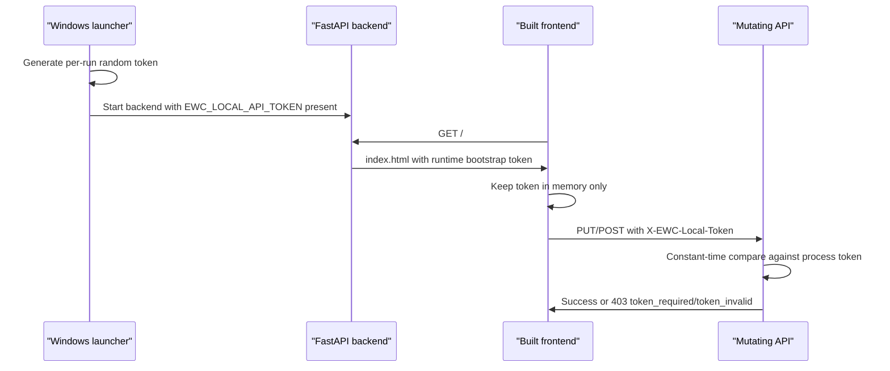

# Launcher Local Token Phase 2 Plan

Status: implemented on branch `codex/launcher-local-token-impl`

Date: 2026-06-07

Scope: per-run local token enforcement for localhost mutating APIs in operator mode.

Implementation result on branch `codex/launcher-local-token-impl`:

- Added backend settings `EWC_LOCAL_API_TOKEN` and `EWC_LOCAL_TOKEN_MODE`.
- Added mutating `/api/*` local token guard with `X-EWC-Local-Token`, constant-time comparison, and stable `403` response shape.
- Operator launcher mode sets `EWC_LOCAL_TOKEN_MODE=required` and passes the per-run token through process environment only.
- Explicit dev opt-out remains available with `EWC_LOCAL_TOKEN_MODE=dev-disabled`.
- Read-only APIs, `OPTIONS`, `/api/health`, `/api/openapi.json`, `/api/docs`, static assets, and SPA routes remain token-free.
- Protected mutating routes include `PUT /api/config`, `POST /api/upload/preview`, `POST /api/upload/preview/{previewRunId}/cancel`, `POST /api/upload/jobs`, Upload Job retry/pause/resume/cancel, and Local Supabase start/stop.
- Read-only health/config/audit, upload preview reads, upload job status reads, and SSE event reads remain available without a token.
- FastAPI injects runtime token bootstrap into served `index.html` responses only when enforcement is enabled. The built `frontend/dist/index.html` file is not mutated, and injected HTML uses `Cache-Control: no-store`.
- Frontend mutating API calls send the token header only to same-origin `/api/*` requests. The token is not stored in URL, `localStorage`, `sessionStorage`, cookies, IndexedDB, config JSON, audit rows, logs, screenshots, or generated artifacts.
- Missing/invalid token failures write rate-limited blocked audit rows with safe metadata only: `reasonCode`, `method`, `routeGroup`, `sourceHost`, and boolean `tokenPresent`.
- Launcher `-CheckOnly` now verifies token policy/generation availability without printing token values.
- Existing launcher phase 1 behavior is preserved: backend bind remains `127.0.0.1`, default operator flow does not run frontend build, port conflict handling remains explicit, and local Supabase/Docker bootstrap/reset/cleanup/prune/create/delete remains forbidden.
- `/api/docs` operator-mode hardening remains out-of-scope for this PR and should be handled by a separate hardening PR.
- Dev caveat: if a developer enables `EWC_LOCAL_API_TOKEN` on a backend used by the Vite dev shell, the Vite page may not receive the backend-served bootstrap token. Use explicit `EWC_LOCAL_TOKEN_MODE=dev-disabled` for that development path.

Validation completed during implementation:

- Targeted backend token/static/launcher tests: 17 passed.
- Full backend tests from clean cwd/config/env: 151 passed.
- `npm run typecheck`: passed.
- `npm run build`: passed.
- `npm run qa:screenshots`: passed.
- Launcher `-CheckOnly`: passed and reported token policy/generation availability without printing token values.
- HTTP smoke: `GET /api/health`, `GET /api/config`, `GET /api/audit`, `GET /api/docs`, and `GET /` worked without token; `OPTIONS /api/config` returned normal route handling (`405`) rather than token-guard `403`; missing-token protected routes returned `403`; invalid-token `PUT /api/config` returned `403`; valid-token `PUT /api/config` returned `200`; `/` served token bootstrap.
- Audit smoke confirmed token failure params remained safe and centered on `reasonCode`, `method`, `routeGroup`, `sourceHost`, and `tokenPresent`.
- `git diff --check`: passed.
- Redaction checks found unsafe marker count `0` across screenshot, backend log, and launcher log artifacts. Generated `.gstack` artifacts, `frontend/dist`, and the untracked operational CSV fixture were not committed.
- Repo cwd `.env` presence can intentionally change Settings/config override behavior. Full backend validation uses clean cwd to avoid repo `.env` influencing test expectations.

Source documents:

- `AGENTS.md`
- `README.md`
- `docs/02_engineering_plan.md`
- `docs/09_local_supabase_control_plan.md`
- `docs/10_audit_logs_plan.md`
- `docs/23_launcher_integration_plan.md`

## Goal

Launcher phase 2 protects the localhost web console's mutating APIs from accidental, cross-site, or local misuse.

The token is a local misuse guard, not full authentication or authorization. The backend remains bound to `127.0.0.1` only. The token reduces risk from CSRF-like localhost POSTs, malicious local pages, browser extensions, and accidental scripts that can reach loopback but do not know the per-run token.

## Non-Goals

- Do not implement multi-user auth.
- Do not allow LAN access.
- Do not place the token in URL query strings.
- Do not store the token in config JSON, state DB, audit rows, logs, screenshots, or generated artifacts.
- Do not change Supabase or Docker command policy.
- Do not run DB reset, delete, cleanup, prune, bootstrap, or container/volume creation.
- Do not weaken existing `127.0.0.1` bind and loopback client enforcement.

## Core Decisions

1. Token generation
   - The launcher generates one random token per backend run.
   - Use cryptographically secure randomness.
   - Minimum entropy: 256 bits.
   - Recommended launcher representation: base64url string without padding.
   - Token lifetime equals the launcher-owned backend process lifetime.
   - A reused already-running backend keeps its existing token; a second launcher must not mint a replacement for that process.

2. Token storage
   - The launcher keeps the token in process memory and passes it to the backend as a process environment variable.
   - Do not write token values to config JSON, state DB, PID files, launcher logs, backend logs, audit rows, PR body, docs, screenshots, `.gstack`, or `frontend/dist` source maps.
   - The backend stores the expected token only in process memory through settings loaded from environment.

3. Backend token intake
   - Add setting: `local_api_token`, read from `EWC_LOCAL_API_TOKEN`.
   - Do not accept the token through process arguments because process lists can expose args more easily.
   - Do not accept the token through config JSON because Settings UI and persistence would turn it into a long-lived secret.
   - Do not accept token values from request query strings.

4. Frontend token delivery
   - Operator static serving should inject token metadata into `index.html` at response time, not at build time.
   - Preferred contract: inject a non-cacheable bootstrap script before `</head>`:

```html
<script nonce="not-required-in-v1">
  window.__EWC_BOOTSTRAP__ = { localApiToken: "<runtime token injected in memory>" };
</script>
```

   - The token value above is illustrative only; real values must never be documented or logged.
   - The frontend reads the token from `window.__EWC_BOOTSTRAP__` and keeps it in memory.
   - Do not store the token in `localStorage`, `sessionStorage`, IndexedDB, cookies, or URL fragments.
   - Browser reload receives a fresh bootstrap response from the same backend process and restores the in-memory token.

5. Request header
   - Frontend sends the token on protected requests with a custom header:

```text
X-EWC-Local-Token: <runtime token>
```

   - The header name is not secret.
   - Never use `Authorization` for this token, to avoid confusion with Supabase Edge authorization.
   - Never send the token to Supabase, Grafana, or any non-same-origin URL.

6. API protection scope
   - Protect mutating API routes only.
   - Read-only APIs remain available to same-origin frontend and localhost read tools.
   - `OPTIONS`, `/api/health`, `/api/openapi.json`, `/api/docs`, static assets, and SPA routes are excluded.

## Token Flow



## Protected Route Matrix

| Route | Method | Protection | Reason |
| --- | --- | --- | --- |
| `/api/config` | `GET` | Exempt | Read-only config shape; secret values are hidden. |
| `/api/config` | `PUT` | Required | Settings save mutates config JSON and writes audit rows. |
| `/api/upload/preview` | `POST` | Required | Starts a preview run and writes state/audit. |
| `/api/upload/preview/latest` | `GET` | Exempt | Read-only preview result query. |
| `/api/upload/preview/{previewRunId}` | `GET` | Exempt | Read-only preview result query. |
| `/api/upload/preview/{previewRunId}/cancel` | `POST` | Required | Cancels active preview state. |
| `/api/upload/jobs` | `POST` | Required | Starts an upload job. |
| `/api/upload/jobs` | `GET` | Exempt | Read-only job list. |
| `/api/upload/jobs/latest` | `GET` | Exempt | Read-only latest job query. |
| `/api/upload/jobs/{jobId}` | `GET` | Exempt | Read-only job detail. |
| `/api/upload/jobs/{jobId}/events` | `GET` | Exempt | SSE read stream. |
| `/api/upload/jobs/{jobId}/retry` | `POST` | Required | Starts retry job. |
| `/api/upload/jobs/{jobId}/pause` | `POST` | Required | Mutates job state. |
| `/api/upload/jobs/{jobId}/resume` | `POST` | Required | Mutates job state. |
| `/api/upload/jobs/{jobId}/cancel` | `POST` | Required | Mutates job state. |
| `/api/runtime/local-supabase` | `GET` | Exempt | Passive status probe only. |
| `/api/runtime/local-supabase/start` | `POST` | Required | Starts existing local runtime through allowlisted command path. |
| `/api/runtime/local-supabase/stop` | `POST` | Required | Stops existing local runtime through allowlisted command path. |
| `/api/runtime/operations/{operationId}` | `GET` | Exempt | Read-only operation detail. |
| `/api/audit` | `GET` | Exempt | Read-only append-only audit query. |
| `/api/dashboard` | `GET` | Exempt | Read-only dashboard data. |
| `/api/dashboard/summary` | `GET` | Exempt | Read-only dashboard summary. |
| `/api/health` | `GET` | Exempt | Launcher readiness probe. |
| `/api/openapi.json`, `/api/docs` | `GET` | Exempt | Developer documentation; localhost only. |
| Static/SPA routes | `GET` | Exempt | Required to load the app and token bootstrap. |
| Any future `POST`, `PUT`, `PATCH`, `DELETE` under `/api/*` | Mutating | Required by default | Avoid missing new mutating endpoints. |

## Backend Contract

Add a small local-token module, for example:

```text
backend/app/core/local_token.py
```

Responsibilities:

- Determine whether enforcement is enabled.
- Validate only protected methods/routes.
- Use constant-time comparison.
- Never log token values.
- Return a stable error shape for missing or invalid tokens.

Recommended response:

```json
{
  "detail": {
    "code": "local_token_required",
    "message": "Local console token is missing or invalid. Restart the web console from the launcher."
  }
}
```

Status code:

- `403 Forbidden` for missing or invalid token.
- Do not use `401` because there is no login flow or credential challenge.

Enforcement defaults:

- Operator launcher mode with `EWC_LOCAL_API_TOKEN` present: enforcement enabled.
- Backend started without token in developer mode: enforcement disabled only when explicit dev setting allows it.
- Backend started without token in operator mode: mutating APIs should fail closed or backend startup should report token misconfiguration. Implementation should choose startup fail-fast if an operator mode flag exists by then.

## Frontend Contract

Add a shared API helper, for example:

```text
frontend/src/api/client.ts
```

Responsibilities:

- Read runtime token from `window.__EWC_BOOTSTRAP__`.
- Attach `X-EWC-Local-Token` to mutating same-origin API calls.
- Never attach the header to external URLs.
- Convert `local_token_required` failures into operator-facing copy.

Affected frontend API modules:

- `frontend/src/api/config.ts`
- `frontend/src/api/uploadPreview.ts`
- `frontend/src/api/uploadJobs.ts`
- `frontend/src/api/runtime.ts`

Do not require the token for `EventSource` upload job events because that endpoint is read-only and adding custom headers to native `EventSource` is not supported without replacing the SSE client.

## Static Serving Contract

FastAPI static serving should serve a token-injected copy of `index.html` for SPA routes when enforcement is enabled.

Rules:

- Do not mutate `frontend/dist/index.html` on disk.
- Do not cache the token-injected HTML response.
- Static JS/CSS assets can remain cacheable.
- `/assets/*` must not expose token values.
- Missing frontend build behavior remains `503`.
- `/api/*` precedence remains unchanged.

Recommended response headers for injected HTML:

```text
Cache-Control: no-store
```

## Launcher Contract

PowerShell launcher phase 2 changes:

- Generate a token before starting the backend.
- Pass it through `EWC_LOCAL_API_TOKEN` in the child backend process environment.
- Log token presence only, for example `Local API token presence is present`.
- Redact token-like and credential-like text before writing launcher logs.
- If an existing backend is already healthy on the port, do not generate a new token for it.
- Existing-backend reuse should open the browser only if the backend can serve a valid bootstrap page for that running token. If not verifiable, report that the existing console must be closed and restarted.

`.bat` wrapper remains a fixed script and must not accept arbitrary shell command fragments.

## Dev Mode Policy

Development must stay usable, but the exception must be explicit.

Recommended policy:

- Vite + backend development can run without token only when `EWC_LOCAL_TOKEN_MODE=dev-disabled` or equivalent explicit setting is present.
- If `EWC_LOCAL_API_TOKEN` is present during development, frontend API helpers should send it.
- Tests should opt into either protected or dev-disabled mode explicitly.
- Do not silently disable enforcement only because `environment=dev`; repo `.env` and process env can differ across machines.

Dev-mode warning:

- Backend startup should log a sanitized warning when mutating token enforcement is disabled.
- The warning must not include any token value.

## CORS And Same-Origin Relationship

The token does not replace existing same-origin and loopback controls.

Keep:

- Backend bind to `127.0.0.1`.
- Loopback client middleware.
- CORS limited to same-origin or known local dev origins.
- No credentialed CORS.

Why token still matters:

- A malicious local webpage can attempt POSTs to `http://127.0.0.1:<port>`.
- Browser CORS usually prevents reading responses, but some unsafe requests can still be attempted.
- A custom header token makes protected writes fail unless the page can read the runtime token from the same-origin app page.

## Audit Policy

Token failures are security-relevant but can be spammed by a malicious page.

Decision:

- Write blocked audit rows for token failures on known mutating action paths.
- Store only safe metadata:
  - `reasonCode`: `local_token_missing` or `local_token_invalid`
  - `method`
  - `routeGroup`, such as `config`, `upload.preview`, `upload.jobs`, or `runtime`
  - `sourceHost`: loopback/non-loopback classification only, not raw headers
  - `tokenPresent`: boolean
- Never store token values, header values, request bodies, DB URLs, file paths, or raw user input.
- Rate-limit audit writes for repeated token failures per route group and short time window.
- Even when audit insertion is rate-limited, the API response remains `403`.

Recommended audit action names:

| Endpoint group | Existing action | Token failure action |
| --- | --- | --- |
| Settings save | `settings.save` | `settings.save` with result `blocked` |
| Upload preview create/cancel | `upload.preview` | `upload.preview` with result `blocked` |
| Upload job start | `upload.start` | `upload.start` with result `blocked` |
| Upload retry | `upload.retry` | `upload.retry` with result `blocked` |
| Upload pause/resume/cancel | `upload.pause`, `upload.resume`, `upload.cancel` | same action with result `blocked` |
| Runtime start/stop | existing runtime action names | same action with result `blocked` |
| Unknown mutating route | `local.token` | `local.token` with result `blocked`, rate-limited |

## Operator UX

Expected operator-visible failures:

- If token bootstrap fails, the app should show a startup/API connection error and ask the operator to restart from the launcher.
- If a protected request returns `local_token_required`, show a concise inline or toast message:

```text
Local console session is no longer valid. Restart the web console from the launcher.
```

Korean copy should be short and operator-facing:

```text
로컬 콘솔 세션이 유효하지 않습니다. 런처로 다시 실행하세요.
```

Do not mention token values, headers, or implementation details in operator UI.

## Failure Modes

| Failure | Expected behavior |
| --- | --- |
| Launcher fails to generate token | Stop before backend start; log sanitized error. |
| Backend starts without token in operator mode | Fail startup or block mutating APIs closed. |
| Token missing on protected API | `403`, operator-facing error, rate-limited blocked audit. |
| Token invalid on protected API | `403`, operator-facing error, rate-limited blocked audit. |
| Frontend bootstrap missing token | Mutating controls show session invalid/restart message. |
| Browser reload | New HTML response restores in-memory token for same backend run. |
| Existing backend on port | Reuse only if bootstrap can be served; otherwise instruct restart. |
| Dev server mode | Works only under explicit dev-disabled setting or explicit test token. |
| Audit repository unavailable | API still returns `403`; failure to audit is logged through normal sanitized backend diagnostics. |
| Token appears in log/screenshot test artifact | QA blocker; fix redaction before merge. |

## Test Plan

Backend tests:

- Token validation accepts correct header on each protected route.
- Missing token returns `403` on protected routes.
- Invalid token returns `403` on protected routes.
- Read-only routes remain accessible without token.
- `OPTIONS`, `/api/health`, `/api/openapi.json`, static routes, and SPA fallback remain accessible.
- Unknown future mutating method under `/api/*` is protected by default.
- Token comparison does not log or echo token values.
- Blocked token failures write safe audit rows and rate-limit repeated spam.
- Dev-disabled mode allows existing tests to opt out explicitly.

Frontend tests:

- Shared API client adds `X-EWC-Local-Token` only to same-origin mutating API requests.
- Read-only API calls do not require token.
- Token error maps to operator-facing copy.
- No token is stored in `localStorage`, `sessionStorage`, URL, cookies, or generated screenshot/text artifacts.
- SSE remains functional without custom headers.

Launcher tests:

- PowerShell token generation uses secure randomness.
- Launcher passes token through environment, not process args or config files.
- Launcher logs token presence only.
- `.bat` remains fixed and does not accept arbitrary commands.
- Existing backend reuse path does not mint or leak a new token.

Smoke tests:

- Operator launcher starts backend and serves token-injected `/`.
- `/api/health` works without token.
- `GET /api/audit` works without token.
- `PUT /api/config` without token returns `403`.
- `PUT /api/config` with token succeeds under safe test config.
- `POST /api/upload/preview` without token returns `403`.
- Runtime start/stop missing-token path returns `403` without running commands.
- `npm run qa:screenshots` passes and redaction scan finds no token-like leak.

## Implementation Order

1. Done: add backend settings for `EWC_LOCAL_API_TOKEN` and explicit token mode.
2. Done: add local-token middleware/dependency and protected route matcher.
3. Done: add safe error DTO and operator-facing frontend error mapping.
4. Done: add static HTML injection for runtime bootstrap token with `Cache-Control: no-store`.
5. Done: add frontend API client helper and update mutating API modules.
6. Done: add launcher secure token generation and env passing.
7. Done: add audit writer/rate limiter for token failure blocked rows.
8. Done: update backend tests for protected/exempt route matrix.
9. Done: update frontend/launcher tests through typecheck/build and launcher source tests.
10. In validation: run full backend tests, frontend typecheck/build, screenshot QA, launcher HTTP smoke, missing-token smoke, and redaction scans.
11. Done: update README and launcher docs after implementation.

## Rollout And Compatibility

- Keep implementation behind explicit environment/mode wiring until all frontend mutating calls send the header.
- Convert backend tests to opt into protected mode only where needed, then add dedicated token enforcement tests.
- After protected route matrix passes, make operator launcher mode token enforcement default.
- Keep dev-disabled mode explicit for local development.
- No DB migration is required.
- No config JSON migration is allowed or needed.

## Open Questions For Implementation PR

- Resolved: operator fail-closed behavior uses `EWC_LOCAL_TOKEN_MODE=required`; explicit local development opt-out uses `EWC_LOCAL_TOKEN_MODE=dev-disabled`.
- Resolved: token failure audit rate limiting is middleware-local memory with a short route-group/action/reason bucket window.
- Deferred: `/api/docs` stays enabled under localhost-only policy in this PR. Operator-mode docs hardening remains a separate hardening PR.

These are implementation details, not blockers for the phase 2 plan.
